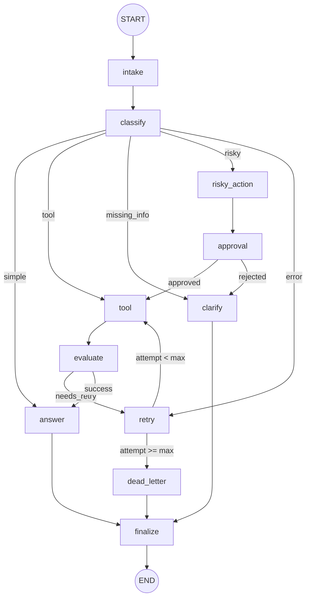

```mermaid
graph TD
    START((START)) --> intake
    intake --> classify
    classify -- simple --> answer
    classify -- tool --> tool
    classify -- missing_info --> clarify
    classify -- risky --> risky_action
    classify -- error --> retry
    
    tool --> evaluate
    evaluate -- needs_retry --> retry
    evaluate -- success --> answer
    
    retry -- attempt < max --> tool
    retry -- attempt >= max --> dead_letter
    
    risky_action --> approval
    approval -- approved --> tool
    approval -- rejected --> clarify
    
    clarify --> finalize
    answer --> finalize
    dead_letter --> finalize
    finalize --> END((END))
```
